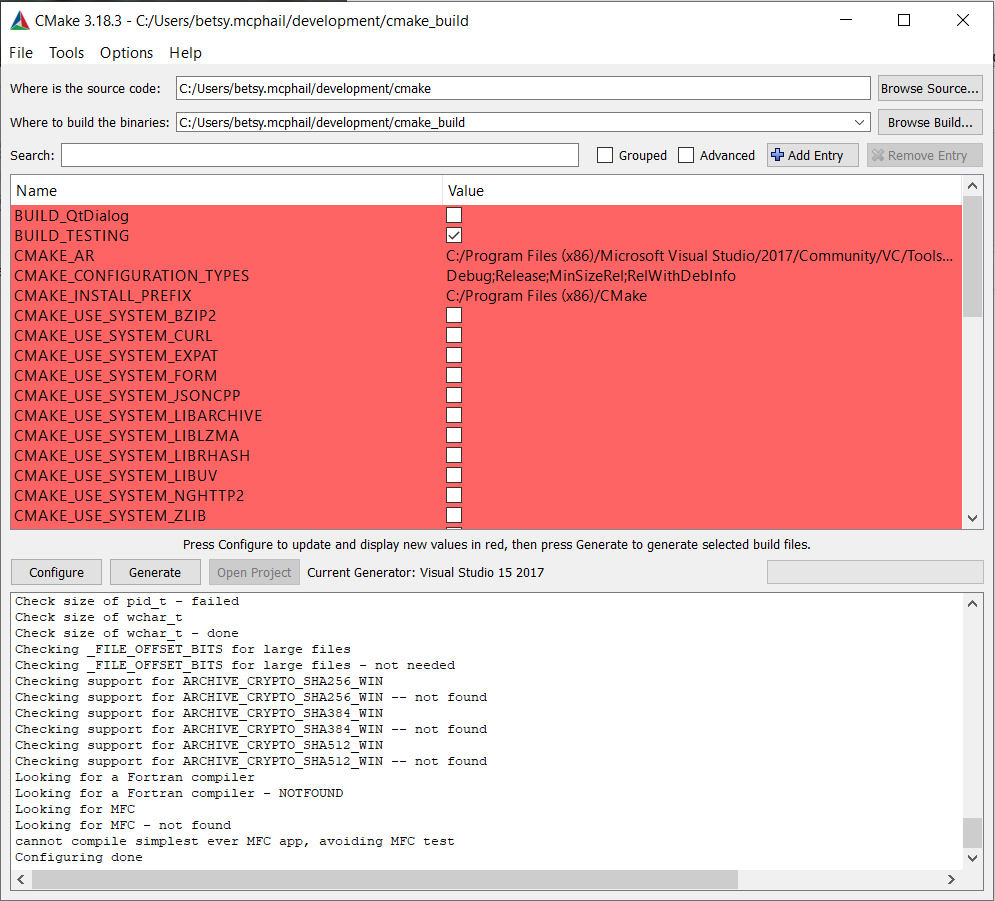
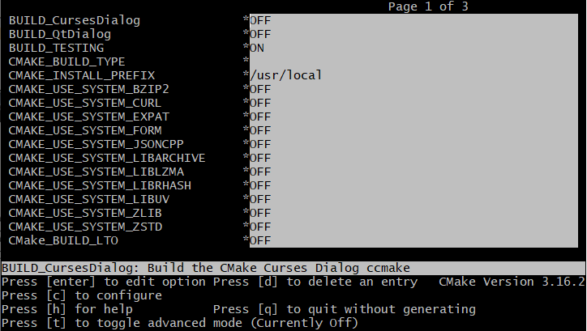

[TOC]
# 获取和安装CMake
Before using CMake, you will need to install or build the CMake binaries on your system. On many systems, you may find that CMake is already installed or is available for installation with the standard package manager tool for the system. Cygwin, Debian, FreeBSD, OS X MacPorts, Mac OS X Fink, and many others all have CMake distributions.

在使用CMake之前，你可能需要在系统上安装或者构建CMake的二进制文件。在许多系统上，你可能会发现CMake已经安装好了或者可以通过系统的标准包管理器安装。Cygwin，Debian，FreeBSD，OS X， MacPorts, Mac OS X Find， 以及许多其他的系统都有CMake的发布版本。


If your system does not have a CMake package, you can find CMake precompiled for many common architectures on the CMake Download page. Select the desired release and follow the download instructions. CMake may be installed to any directory, so root privileges are not required for installation.

如果你的系统没有CMake的安装包，你可以在CMake的下载页面找到很多常见架构的预编译文件。选择所需的版本，并按照下载说明进行操作。CMake可以安装到任意目录，因此安装时不需要root权限。

If you do not find precompiled binaries for your system, then you can build CMake from source. To build CMake, you will need a modern C++ compiler and the source distribution from the CMake Download page or Kitware’s GitLab instance. To build CMake, follow the instructions in Readme.txt at the top of the source tree.

如果您没有找到您系统的预编译二进制文件，那么您可以从源代码开始构建CMake。为了构建CMake，您需要一个现代C++编译器和从CMake下载页面或者KitWare的Gitlab获得的源码版本。请按照源码目录顶层的ReadMe.txt中的步骤操作。
# 目录结构
There are two main directories CMake uses when building a project: the source directory and the binary directory. The source directory is where the source code for the project is located. This is also where the CMakeLists files will be found. The binary directory is sometimes referred to as the build directory and is where CMake will put the resulting object files, libraries, and executables. CMake will not write any files to the source directory, only to the binary directory.

CMake在构建项目的过程中，主要使用两个目录：源码目录和二进制目录。源码目录是存放项目源码的位置，在这也可以找到CMakeLists文件。二进制目录有时也被称为编译目录，这是CMake用于存放目标文件，库和可执行文件的位置。CMake不会将任何文件写入到源码目录中，只会在二进制目录中。

Out-of-source builds, where the source and binary directories are different, are strongly encouraged. In-source builds where the source and binary directories are the same are supported but should be avoided if possible. Out-of-source builds make it very easy to maintain a clean source tree and allow quick removal of all of the files generated by a build. Having the build tree differ from the source tree also makes it easy to support having multiple builds of a single source tree. This is useful when you want to have multiple builds with different options but just one copy of the source code.

我们强烈推荐这种将源码目录和二进制目录分开这种源码外构建方式。CMake也支持那种二进制和源码混在一起的那种源码内构建方式，但是需要尽可能的去避免。源码外的这种方式非常容易维护一个干净的源码树，允许快速删除构建生成的文件。构建树和源码树不同也允许针对同一份源码生成多个构建。这在您仅有一份源码而希望使用不同构建选项进行多次构建时会很有用。
# 基本CMake用法

CMake takes one or more CMakeLists files as input and produces project files or Makefiles for use with a wide variety of native development tools.

CMake使用一个或多个CmakeList文件作为输入，生成供一系列原生开发工具使用的工程文件或者Makefile。

The typical CMake process is as follows:

1 The project is defined in one or more CMakeLists files

2 CMake configures and generates the project

3 Users build project with their favorite native development tool

Each step of the process is described in detail in the following sections.

CMake的典型流程如下：

1. 工程定义一个或者多个 CMakelists文件。
2. 通过CMake配置和生成工程文件。
3. 用户使用他们喜欢的原生开发工具构建项目。

下面几节中讲详细描述上述过程的每一步。

# CMakeLists 文件
The CMakeLists files (actually CMakeLists.txt but it is common to leave off the extension) are plain text files that contain the project description in CMake’s Language. The cmake-language is expressed as a series of comments, commands and variables. You might wonder why CMake decided to have its own language instead of using an existing one such as Python, Java, or Tcl. The main reason is that CMake developers did not want to make CMake require an additional tool to run. By requiring one of these other languages, all users of CMake would be required to have that language installed, and potentially a specific version of that language. This is on top of the language extensions that would be required to do some of the CMake work, for both performance and capability reasons.

CMakeLists文件（实际上是CMakeLists.txt文件，但我们常常省略后缀）是纯文本文件，包含了使用CMake语言描述的工程信息。CMMake语言由一系列注释、命令和变量构成。您可能会好奇为啥CMake不使用已有的语言例如Python，Java或者Tcl，而是自定义的语言。主要原因在于CMake的开发者不希望CMake依赖其他工具。如果使用其他语言，CMake的使用者需要安装那种语言，潜在的需要那种语言的特殊版本。处于性能和功能方面的原因，需要在语言扩展之上做一些CMake的工作。

## Hello World for CMake
To begin, let us consider the simplest possible CMakeLists file. To compile an executable from one source file, the CMakeLists file would contain three lines:

```
cmake_minimum_required(VERSION 3.20)
project(Hello)
add_executable(Hello Hello.c)
```

The first line of the top level CMakeLists file should always be cmake_minimum_required. This allows projects to require a given version of CMake and, in addition, allows CMake to be backwards compatible.

The next line of any top level CMakeLists file should be the project command. This command sets the name of the project and may specify other options such as language or version.

For each directory in a project where the CMakeLists.txt file invokes the project command, CMake generates a top-level Makefile or IDE project file. The project will contain all targets that are in the CMakeLists.txt file and any subdirectories, as specified by the add_subdirectory command. If the EXCLUDE_FROM_ALL option is used in the add_subdirectory command, the generated project will not appear in the top-level Makefile or IDE project file; this is useful for generating sub-projects that do not make sense as part of the main build process. Consider that a project with a number of examples could use this feature to generate the build files for each example with one run of CMake, but not have the examples built as part of the normal build process.

Finally, use the add_executable command to add an executable to the project using the given source file.

In this example, there are two files in the source directory: CMakeLists.txt and Hello.c.

The next sections will describe how to configure and build the project using the CMake GUI and command line interfaces.
# Configure and Generate
After a CMakeLists file has been created, CMake processes the text file and creates entries in a cache file. Users may edit the CMakeLists file or specify cache values with the CMake gui or ccmake and re-configure. Next, CMake uses the cache entries to generate a project in the user’s desired build system (e.g. Makefile or Visual Studio solution).

## Running the CMake GUI
CMake includes a Qt-based user interface that can be used on most platforms, including UNIX, Mac OS X, and Windows. The cmake-gui is included in the CMake source code, but you will need an installation of Qt on your system in order to build it.


On Windows, the executable is named cmake-gui.exe and it should be in your Start menu under Program Files. There may also be a shortcut on your desktop, or if you built CMake from the source, it will be in the build directory. For UNIX and Mac users, the executable is named cmake-gui and it can be found where you installed the CMake executables. A GUI will appear similar to what is shown in Figure 1. The top two fields are the source code and binary directories. They allow you to specify where the source code is located for what you want to compile, and where the resulting binaries should be placed. You should set these two values first. If the binary directory you specify does not exist, it will be created for you. If the binary directory has been configured by CMake before, it will then automatically set the source tree.
## Running the ccmake Curses Interface
On most UNIX platforms, if the curses library is supported, CMake provides an executable called ccmake. This interface is a terminal-based text application that is very similar to the cmake-gui. To run ccmake, change directories into the directory where you want the binaries to be placed. Then run ccmake with the path to the source directory on the command line. This will start the text interface as shown in Figure 2.


Brief instructions are displayed in the bottom of the window. If you hit the “c” key, it will configure the project. You should always configure after changing values in the cache. To change values, use the arrow keys to select cache entries, and hit the enter key to edit them. Boolean values will toggle with the enter key. Once you have set all the values as you like, you can hit the “g” key to generate the Makefiles and exit. You can also hit “h” for help, “q” to quit, and “t” to toggle the viewing of advanced cache entries.
## Running CMake from the Command Line
From the command line, the cmake executable can be used to generate a project buildsystem. This is best suited for projects with few or no options. For larger projects like VTK, using ccmake, or the cmake-gui is recommended. To build a project with cmake, first create and change directory to where you want the binaries to be placed. Run cmake specifying the path to the source tree and pass in any options using the -D flag. Unlike ccmake, or the cmake-gui, the configure and generate steps are combined into one when using the cmake executable.
## Specifying the Compiler to CMake

On some systems, you may have more than one compiler to choose from or your compiler may be in a non-standard place. In these cases, you will need to specify to CMake where your desired compiler is located. There are three ways to specify this: the generator can specify the compiler; an environment variable can be set; or a cache entry can be set. Some generators are tied to a specific compiler; for example, the Visual Studio 19 generator always uses the Microsoft Visual Studio 19 compiler. For Makefile-based generators, CMake will try a list of usual compilers until it finds a working one.

The lists can be preempted with environment variables that can be set before CMake is run. The CC environment variable specifies the C compiler, while CXX specifies the C++ compiler. You can specify the compilers directly on the command line by using -DCMAKE_CXX_COMPILER=cl for example. Once cmake has been run and picked a compiler, if you wish to change the compiler, start over with an empty binary directory.

The flags for the compiler and the linker can also be changed by setting environment variables. Setting LDFLAGS will initialize the cache values for link flags, while CXXFLAGS and CFLAGS will initialize CMAKE_CXX_FLAGS and CMAKE_C_FLAGS respectively.
## Build Configurations
Build configurations allow a project to be built in different ways for debug, optimized, or any other special set of flags. CMake supports, by default, Debug, Release, MinSizeRel, and RelWithDebInfo configurations. Debug has the basic debug flags turned on. Release has the basic optimizations turned on. MinSizeRel has flags that produce the smallest object code, but not necessarily the fastest code. RelWithDebInfo builds an optimized build with debug information as well.

CMake handles the configurations in slightly different ways depending on the generator being used. The conventions of the native build system are followed when possible. This means that configurations impact the build in different ways when using Makefiles versus using Visual Studio project files.

The Visual Studio IDE supports the notion of Build Configurations. A default project in Visual Studio usually has Debug and Release configurations. From the IDE you can select build Debug, and the files will be built with Debug flags. The IDE puts all of the binary files into directories with the name of the active configuration. This brings about an extra complexity for projects that build programs that need to be run as part of the build process from custom commands. See the CMAKE_CFG_INTDIR variable and the custom commands section for more information about how to handle this issue. The variable CMAKE_CONFIGURATION_TYPES is used to tell CMake which configurations to put in the workspace.

With Makefile-based generators, only one configuration can be active at the time CMake is run, and it is specified with the CMAKE_BUILD_TYPE variable. If the variable is empty then no flags are added to the build. If the variable is set to the name of a configuration, then the appropriate variables and rules (such as CMAKE_CXX_FLAGS_<ConfigName>) are added to the compile lines. Makefiles do not use special configuration subdirectories for object files. To build both debug and release trees, the user is expected to create multiple build directories using the out-of-source build feature of CMake, and set the CMAKE_BUILD_TYPE to the desired selection for each build. For example:
```
# With source code in the directory MyProject
# to build MyProject-debug create that directory, cd into it and
ccmake ../MyProject -DCMAKE_BUILD_TYPE=Debug
# the same idea is used for the release tree MyProject-release
ccmake ../MyProject -DCMAKE_BUILD_TYPE=Release
```
# 构建您自己的工程
After you have run CMake, your project will be ready to be built. If your target generator is based on Makefiles then you can build your project by changing the directory to your binary tree and typing make (or gmake or nmake as appropriate). If you generated files for an IDE such as Visual Studio, you can start your IDE, load the project files into it, and build as you normally would.

在运行CMake后，您的工程将可以用于构建了。如果您的目标生成器是基于Makefile的，您可以切换到二进制目录，输入make命令进行编译。如果您为一个IDE如Visual Studio生成项目文件，您可以打开IDE，加载项目文件，像往常一样构建它。

Another option is to use cmake’s --build option from the command line. This option is simply a convenience that allows you to build your project from the command line, even if that requires launching an IDE.
另一个选择是在命令行中使用Cmake的"--build"选项。这带来了一种便利，允许您从命令行构建项目，即使这样需要启动IDE。

That is all there is to installing and running CMake for simple projects. In the following chapters, we will consider CMake in more detail and explain how to use it on more complex software projects.

这就是为一个简单项目安装和运行 CMake 的全部内容。 在接下来的章节中，我们将更详细地讲解CMake 并解释如何在更复杂的软件项目中使用它。
